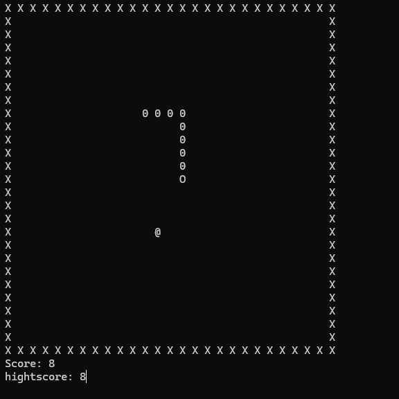

# Snake - My first snake

My very first snake game, played in the Windows console and written in C++.



## Running

Requires Windows, and may need the [Microsoft Visual C++ Redistributable (x64)](https://learn.microsoft.com/en-us/cpp/windows/latest-supported-vc-redist) if it isn't already installed.

Download [Snake_Game.exe](Snake_Game.exe) and run it.

On Linux it can be run with [Wine](https://www.winehq.org/):

```
wine Snake_Game.exe
```

## Quirks

- The screen is cleared and redrawn every frame, so the game flickers.
- The random number generator is never seeded, so the apples appear in the same positions every game.
- The high score is saved to `highscore.txt` next to the game.

## Story

This snake game is from the very start of my text-based programming career.
Making games was one of my main motivations for learning C++, and something I still do today.
It was one of the first (if not the very first) things I made in a lower-level language, rather than something like Python or JavaScript.
I used Visual Studio because that's what the tutorials I found online used.

Looking back, I wrote it more like C than C++. At the time, I saw C++ as simply C, but better.

The source code has since been lost, so only the compiled exe remains.
